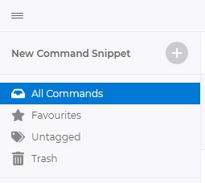
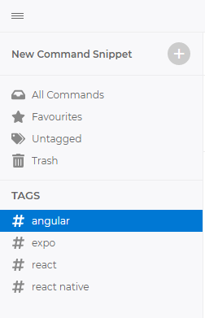
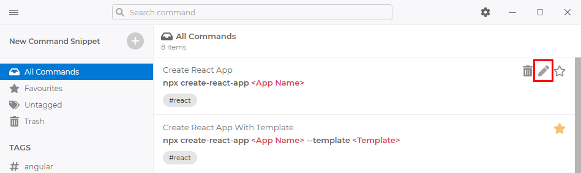
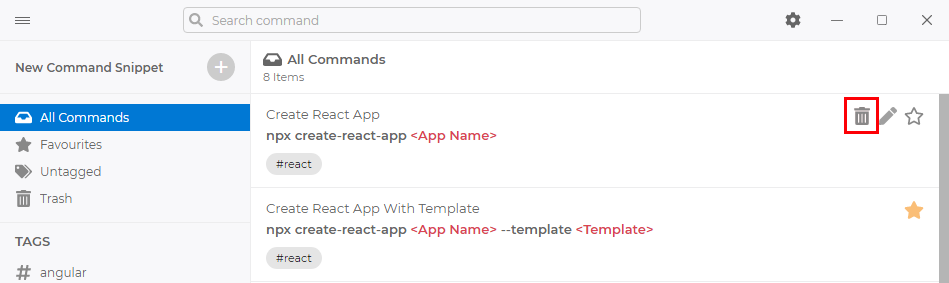
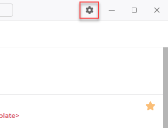

# DOCUMENTATION

## LAYOUT
**SnipCommand** has a two-column interface. First column displays the application and tags library where all commands are stored. The second column displays all the commands in selected location.

 

## LIBRARY
The library contains system folders **All Commands**, **Favourites**, **Untagged**, **Trash**.

- **All Commands:** Contains all unorganized commands.
- **Favourites:** Favourite commands for quick access.
- **Untagged:** Contains all untagged commands.
- **Trash:** This is where the command you delete get in. You can restore or delete permanently command snippet from here.

 

## TAGS
You can organize your command snippets with tags. The tags organize in command window. The command window open with **New Command Snippet** or edit existing snippet.

 
 

## COMMAND SNIPPETS

### New Command Snippet
Click the **New Command Snippet** button top of the first column.

### Edit Existing Snippet
Click the pencil icon on existing snippet which is you want to edit.

### Delete Existing Snippet
Click the trash icon on existing snippet which is you want to delete.

### Favourite/Unfavourite Existing Snippet
Toggle the star icon on existing snippet which is you want to add or remove the favourite list.

### Command Snippet Dialog

- **Title:** The title of command snippet
- **Tags:** The tags of your command snippets. It needs to be organize your command. You can describe the tags with ENTER key. There is an autocomplete you entered before.
- **Command:** There are 3 dynamic parameters. **Variable**, **Choice (Select)** and **Password**. *Variable*; It will help the fill free style text. *Choice (Select)*; It will help the select from selectbox. *Password*; It will help the random password value you specified length.
- **Description:** You can write the description with Markdown Editor.

 

## Storage
All your commands snippets are on your computer locally. You can change the folder where your commands will be stored or open existing storage. To go to **Storage** settings, click the settings icon on top menu bar, then go to **Storage**.

- **Open Directory...:** It help you open existing storage path.
- **Move Directory...:** Select the folder where the snippets will be stored.
 

## Backup / Restore
**SnipCommand** automatically creates a library backup every 6 hours when the application is launched. But you can also backup your storage with manually.

- **Change Folder...:** Select the folder where the backups will be created.
- **Backup Now:** Backup your storage now
- **Restore:** You can restore from a backup list of below.
 

## Sync
You can use any service that provides cloud synchronization, such as iCloud Drive, Google Drive, Dropbox or other similar. For integrate the your service, please click the **Move Directory...** and select the your cloud folders are located on your computer.